<p align="center">
  
</p>

# Vedic Mitra

> Bringing the Vedic tradition back into everyday use — an offline, exhaustive companion for
> panchanga, muhurta and the shastras that hang off them. Kotlin, Jetpack Compose, Clean
> Architecture.

[](https://github.com/imskylab/vedic-mitra/actions/workflows/ci.yml)
[](LICENSE)
[](docs/COMMERCIAL_LICENSE.md)
[](https://kotlinlang.org)
[](https://developer.android.com/jetpack/compose)

## Screenshots

<table>
  <tr>
    <td align="center">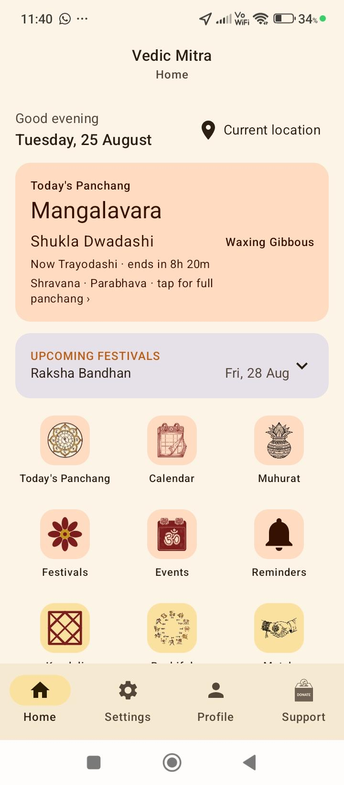<br/><sub><b>Home hub</b></sub></td>
    <td align="center">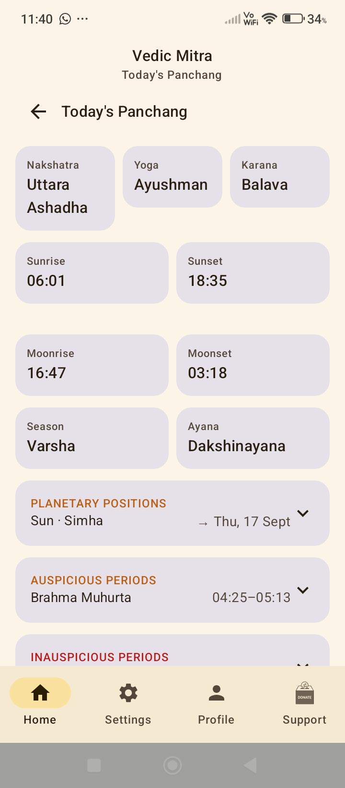<br/><sub><b>Daily Panchang</b></sub></td>
    <td align="center">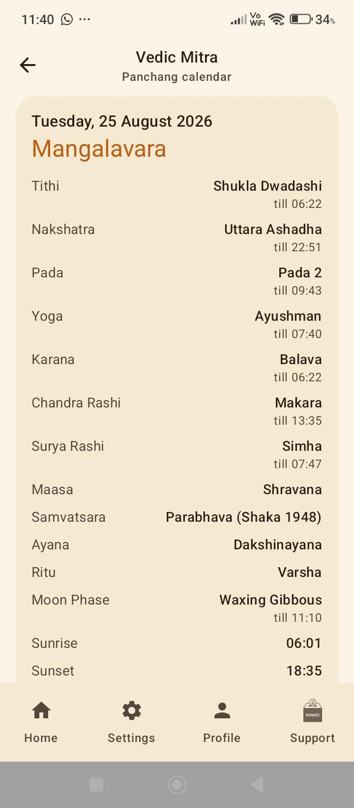<br/><sub><b>Calendar</b></sub></td>
  </tr>
  <tr>
    <td align="center">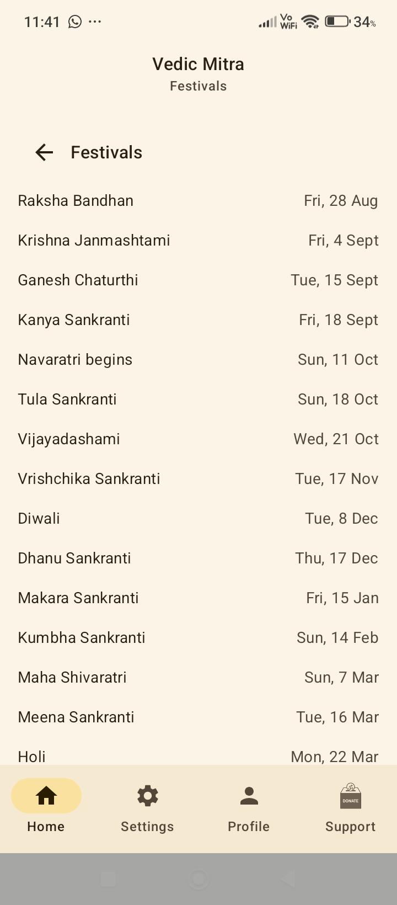<br/><sub><b>Festivals</b></sub></td>
    <td align="center">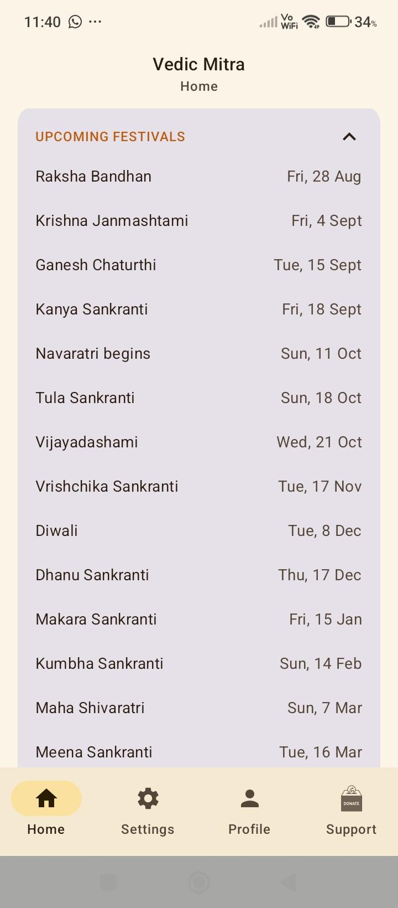<br/><sub><b>Upcoming festivals</b></sub></td>
    <td align="center">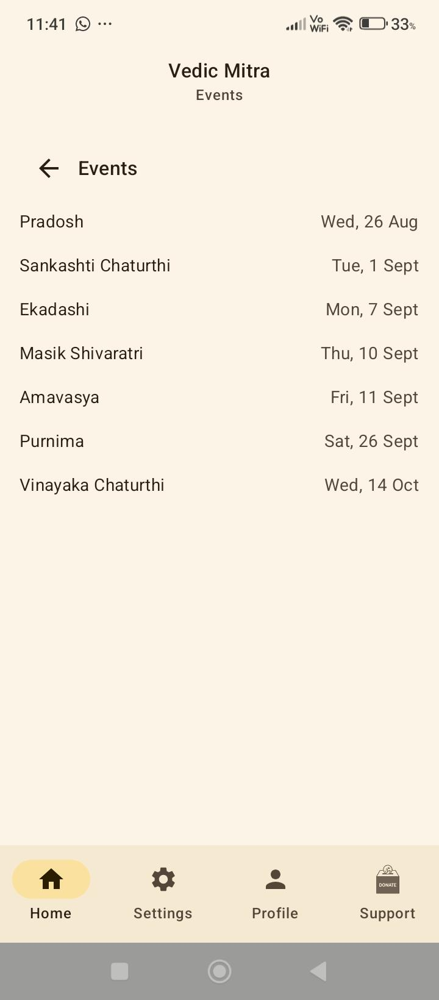<br/><sub><b>Events</b></sub></td>
  </tr>
  <tr>
    <td align="center">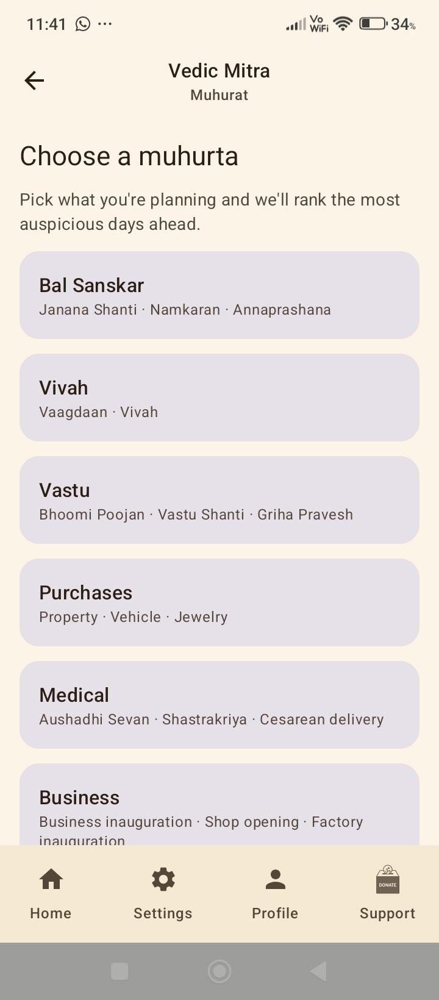<br/><sub><b>Muhurat</b></sub></td>
    <td align="center">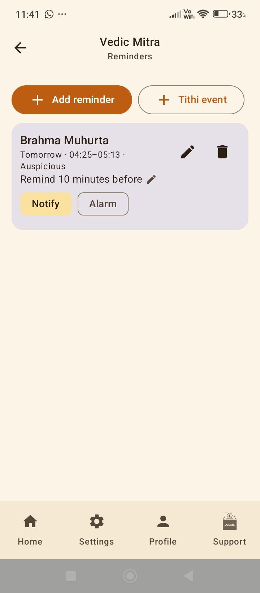<br/><sub><b>Reminders</b></sub></td>
    <td align="center">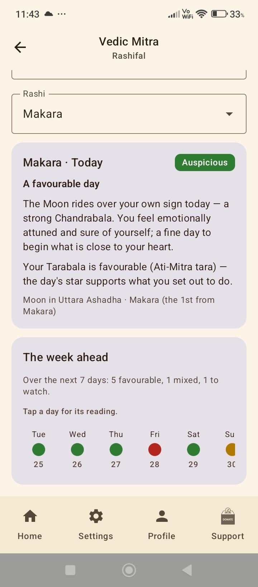<br/><sub><b>Rashifal</b></sub></td>
  </tr>
  <tr>
    <td align="center">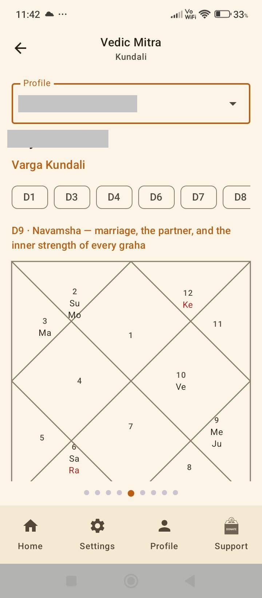<br/><sub><b>Kundali</b></sub></td>
    <td align="center">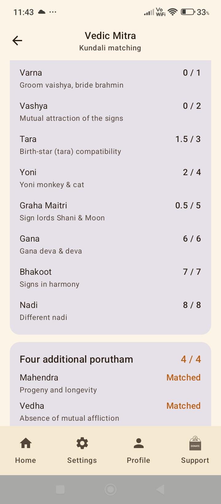<br/><sub><b>Kundali Matching</b></sub></td>
    <td align="center">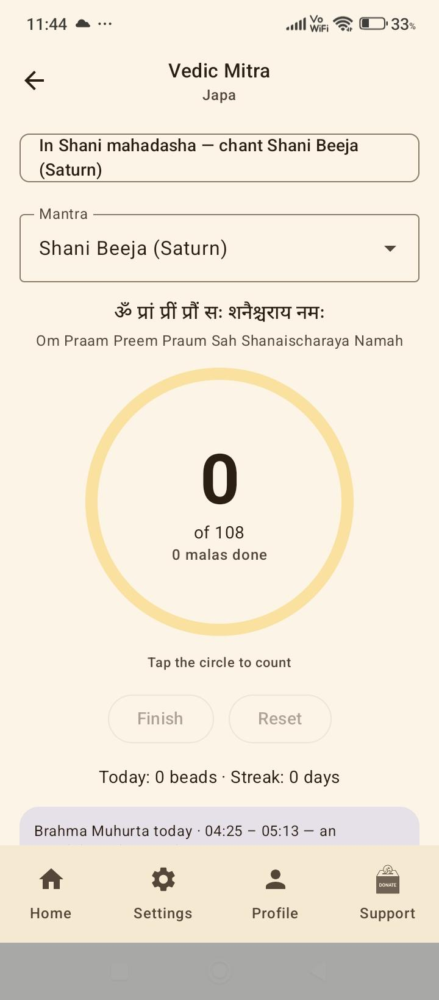<br/><sub><b>Japa</b></sub></td>
  </tr>
  <tr>
    <td align="center">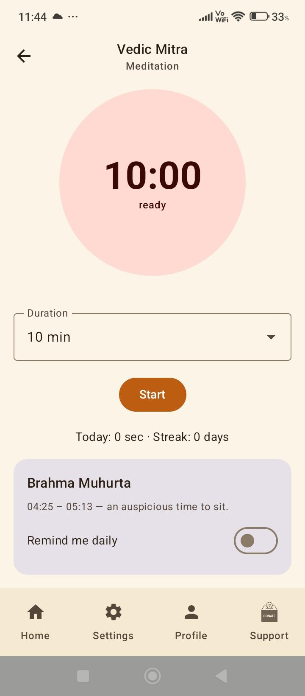<br/><sub><b>Meditation</b></sub></td>
    <td align="center">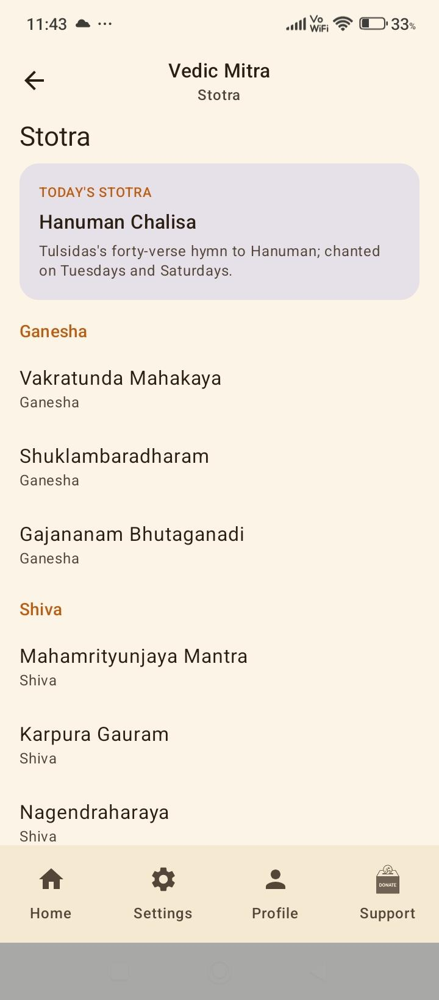<br/><sub><b>Stotra</b></sub></td>
    <td></td>
  </tr>
</table>

> **Status:** The **panchanga, muhurta and jyotisha** domains are largely built; the wider shastra
> map in [docs/roadmap.md](docs/roadmap.md) is mostly open. The app computes
> today's Panchang (tithi, nakshatra, yoga, karana, paksha, vara, ayana, ritu, maasa in either the
> amanta or purnimanta scheme, samvatsara and the Vikrama/Shaka/Kali years),
> Brahma/Abhijit Muhurta, Dur Muhurta, Varjyam, the inauspicious kalams (Rahu, Yamaganda, Gulika),
> the sixteen Choghadiya windows, sunrise/sunset, moonrise/moonset, Moon phase, golden-hour windows,
> and the graha rashi positions (Sun/Moon/Guru/Shukra) with their next pravesh — for any saved or
> GPS location, with offline timezone/DST detection. It derives upcoming festivals, lunar
> observances (Ekadashi, Purnima, Amavasya, Sankashti Chaturthi, Pradosh, …) and Sankrantis, and
> schedules reboot-survivable, per-event-configurable reminders for muhurta, Choghadiya, and tithi
> events. It shows all of this on a home dashboard and a browsable monthly **Panchang** calendar
> (tap any day for its full panchang; notable days are highlighted), wrapped in a golden/maroon
> brand theme drawn from the app emblem, navigated via a bottom bar. Calculations — including the
> sunrise-tithi convention by which the day is named — are cross-checked against published
> almanacs and an independent reference implementation before shipping. The astrology arc is now
> largely built — natal charts, seventeen divisional charts, three dasha systems, ashtakavarga,
> matchmaking and muhurta. The app is **not yet localized** and ships in English only. See the
> [Roadmap](#roadmap) for the full picture and current progress.

---

## Project Vision

**Vedic Mitra ("Vedic Friend") exists to bring the Vedic tradition back into everyday use.** Not to
archive it, and not to admire it from a distance — to put its practices and its knowledge back
within reach of an ordinary weekday.

Much of this was never really lost. It was made **inconvenient**. Knowing when a tithi turns, which
month it is under which reckoning, when a season changes, what a text actually says — all of it was
once common knowledge and is now specialist. The aim is a single exhaustive place for it: the
panchanga first, because it is the thread every other practice hangs from, and then the shastras
that depend on it — timing, chart, ritual, routine, recitation, craft.

**An app does not revive a practice by listing it.** It does so by making it doable: saying what a
tradition holds, saying *when* it applies, and keeping a private record that you kept it. Knowing
when is what turns a described practice into a done one — a seasonal routine needs the ritu, a
ritual needs its muhurta, a vrata needs its tithi — and the engine already knows all three.

That is also why this is built as a **foundation rather than a finished product**. The domain map in
[docs/roadmap.md](docs/roadmap.md) is deliberately larger than one person will finish, every domain
on it has a tile in the app whether or not it is built, and
[docs/knowledge-standards.md](docs/knowledge-standards.md) sets what any of it must stand on before
it ships. The direction is meant to outlast whoever is currently writing the code.

Guiding principles:

- **Accuracy first** — astronomy is computed, not looked up, from the observer's coordinates.
- **Say what stands behind a claim** — computation is validated against an independent reference;
  traditional knowledge is cited to a named source and attributed, never asserted in the app's own
  voice. See [docs/knowledge-standards.md](docs/knowledge-standards.md).
- **Record what is not done** — every deliberate narrowing is written down beside the code.
- **Offline-friendly** — core calculations run on-device. No ads, no tracking, no accounts.
- **Respectful, uncluttered UX** — Material 3, light/dark, dynamic colour.
- **Maintainable by many** — strict modular Clean Architecture so features stay independent.

## Architecture

Vedic Mitra follows **Clean Architecture** with a **feature-first**, **multi-module** layout, using
**MVVM** for presentation, the **Repository pattern** for data, and **Hilt** for dependency
injection.

### Layer rules

```
UI (Compose)  →  ViewModel (MVVM)  →  UseCase / Domain  →  Repository  →  Data source / Port
```

- Dependencies point **inwards**: UI depends on domain abstractions, never the reverse.
- Features never depend on other features — only on `:core:*` modules.
- Cross-cutting capabilities (astronomy, scheduling, notifications, location) are exposed as
  **ports** (interfaces) in `:core`, so implementations are swappable and testable.

### Module graph

```
                              ┌─────────┐
                              │  :app   │  (Hilt root, single Activity, nav host)
                              └────┬────┘
      ┌──────────────────────┬─────┴──────┬──────────────────────┐
 ┌────▼─────┐         ┌──────▼─────┐ ┌────▼──────┐        ┌──────▼──────┐
 │ Daily    │         │ Astrology  │ │ Devotion  │        │ Support     │
 │ home     │         │ kundali    │ │ japa      │        │ settings    │
 │ calendar │         │ muhurat    │ │ meditation│        │ location    │
 │ alarm    │         │ matchmaking│ │ stotra    │        │ profile     │
 │          │         │ rashifal   │ │           │        │             │
 └────┬─────┘         └──────┬─────┘ └────┬──────┘        └──────┬──────┘
      └──────────────────────┴─────┬──────┴──────────────────────┘
                    features depend on core ports only
 ┌─────────────────────────────────┴────────────────────────────────────┐
 │ :core:common   :core:ui   :core:designsystem   :core:datastore       │
 │ :core:astronomy   :core:domain   :core:scheduler   :core:alarm       │
 │ :core:notifications   :core:location                                 │
 └──────────────────────────────────────────────────────────────────────┘
```

| Module | Responsibility |
| --- | --- |
| `:app` | Application shell: Hilt root, single Activity, navigation host, module assembly. |
| `:core:common` | Framework-agnostic building blocks: `AppResult`, dispatcher abstractions, value types. |
| `:core:ui` | Reusable Compose widgets and preview tooling. |
| `:core:designsystem` | Material 3 theme: colour, typography, shapes, spacing tokens, shared tables and icons. |
| `:core:astronomy` | Panchanga and jyotisha engine: Meeus ephemeris, Lahiri ayanamsa, muhurta windows, natal charts, vargas, dashas, ashtakavarga, matchmaking. |
| `:core:domain` | Use cases shared by more than one feature (e.g. resolving which location to compute for). |
| `:core:scheduler` | `AlarmManager`-backed exact scheduling of reminder notifications. |
| `:core:alarm` | Ringing-alarm playback and its lifecycle. |
| `:core:notifications` | `NotificationManagerCompat`-backed channels and notification posting. |
| `:core:location` | Device location via Play Services fused provider, plus offline coordinate → time-zone resolution. |
| `:core:datastore` | Persisted preferences and birth profiles on Jetpack DataStore. |
| `:feature:home` | Landing hub: today's panchanga hero, category tabs, shortcut grid. |
| `:feature:calendar` | Browsable monthly panchang grid; tap a day for its full panchang. |
| `:feature:alarm` | Reminders: schedule notifications for muhurta windows, Choghadiya and custom tithis. |
| `:feature:location` | Location picking: GPS, city search, manual coordinates, saved locations. |
| `:feature:profile` | Birth profiles — the prerequisite for every chart-based feature. |
| `:feature:kundali` | The chart book: charts, jataka, grahas, yogas, dashas, reading. |
| `:feature:muhurat` | Electional muhurta: ranked windows for an activity, optionally personalised. |
| `:feature:matchmaking` | Kundali matching: Ashtakoota, the four porutham, Mangal dosha. |
| `:feature:rashifal` | Computed daily and weekly outlook by rashi. |
| `:feature:japa` | 108-bead mala counter with a daily streak. |
| `:feature:meditation` | Meditation timer with a daily streak. |
| `:feature:stotra` | Offline stotra library. |
| `:feature:settings` | Settings: theme, and the Support screen. |

Build configuration is not copy-pasted between modules — it lives in **convention plugins** under
[`build-logic/`](build-logic), applied by id (e.g. `vedicmitra.android.feature`). See
[docs/architecture.md](docs/architecture.md) and [docs/module-guide.md](docs/module-guide.md).

## Tech Stack

| Area | Choice |
| --- | --- |
| Language | Kotlin 2.3.10 (JDK 21) |
| UI | Jetpack Compose, Material 3 |
| Architecture | Clean Architecture, MVVM, Repository pattern |
| DI | Hilt (+ KSP) |
| Async | Kotlin Coroutines / Flow |
| Build | AGP 9.3.1 on Gradle 9.6.1 (Kotlin DSL), Version Catalog, convention plugins |
| Quality | Detekt, Spotless, Ktlint |
| Testing | JUnit4, Truth, MockK, Turbine, Coroutines-test |
| CI | GitHub Actions |

## Roadmap

**The full map is [docs/roadmap.md](docs/roadmap.md)** — organised by domain rather than by phase,
so a contributor can pick up one area without knowing what came before it. Status marks there
reflect what is actually implemented, verified against the code.

Vedic Mitra aims to be a single, offline, honest place for the practices and knowledge of the Indian
tradition — the panchanga first, and then the shastras that hang off it. The engine's knowledge of
*when* is what ties them together: a seasonal routine needs the ritu, a ritual needs its muhurta, a
vrata needs its tithi, and the app already computes all three.

| | Domains |
| --- | --- |
| **Built** | Panchanga · Jyotisha (reporting gaps remain) · Muhurta · Festivals and observances |
| **In progress** | Regional variation (month scheme settled; solar calendars next) · Content sources (required and enforced; 38 entries still to identify) |
| **Next** | Dharma and the samskaras |
| **Open for contribution** | Localization · Vastu · Chandas · Ayurveda (bounded) · Yoga · Accessibility · Kalpa (sankalpa frame shipped) · Time reckoning (era years shipped) |
| **Exploring** | The arts (media-constrained) · Portable engine and iOS · Prashna and Varshaphala |
| **Declined** | Arthashastra · Dhanurveda · Sanskrit tutoring · remedy commerce — [reasons recorded](docs/roadmap.md#part-vi--declined-and-why) |

**Before contributing to any knowledge domain, read
[docs/knowledge-standards.md](docs/knowledge-standards.md).** It sets out what the app is allowed to
say and what has to stand behind it: astronomy is *validated* against an independent reference,
traditional knowledge is *cited* to a named source, practice tracking claims nothing at all, and
explanatory copy is enforced by a test. It also states the red lines — no medical claims, no
fatalism, no instruction in anyone's practice, no remedy commerce.

Three foundations come before the breadth. **Regional variation** and **content provenance** are
under way: the month scheme is now a setting the app names on every reading, and every bundled text
is required to carry a source — currently an explicit "not recorded" on all 38, shown to the reader,
with a test so that count can shrink but never grow.

**Localization has not started and is the largest gap.** The app is English-only and not
localized at all — 599 hardcoded strings, no `stringResource` calls, no locale. It limits who this
can reach more than anything else on the roadmap, and it needs Indic language knowledge rather than
Android knowledge, which makes it the best place for a first contribution.

[ADR 0016](docs/adr/0016-shastra-domains-and-knowledge-modes.md) records why the twelve-phase plan
was retired and what replaced it.

## Build Instructions

> **Android Studio is not required.** The project is command-line/CI-first — build it from a
> terminal, from VS Code tasks, or entirely on GitHub. Full setup (including installing the Android
> SDK command-line tools without Android Studio) is in [docs/getting-started.md](docs/getting-started.md).

### Build on GitHub (no local setup)

- Push a branch → the [CI workflow](.github/workflows/ci.yml) builds the APK and uploads it as an
  artifact on the Actions run.
- Push a `v*` tag → the [release workflow](.github/workflows/release.yml) attaches an installable
  (debug-signed) APK to a GitHub Release.

### Prerequisites (local CLI build)

- **JDK 21** — Gradle runs on it (auto-detected; a local JDK 21 is recommended).
- **Android SDK command-line tools** with platform **API 36** and `build-tools;36.0.0` — install via
  `sdkmanager`, no Android Studio needed. Set `ANDROID_HOME` or create `local.properties` with
  `sdk.dir=...`.

### Common commands

```bash
# Build the debug APK
./gradlew assembleDebug

# Run unit tests
./gradlew testDebugUnitTest

# Formatting + static analysis (the CI quality gate)
./gradlew spotlessCheck detekt

# Auto-fix formatting
./gradlew spotlessApply

# List all modules
./gradlew projects
```

Convenience wrappers live in [`scripts/`](scripts) (`format` and `check`).

The debug APK is written to `app/build/outputs/apk/debug/`.

### Release builds (installable, updatable)

For a signed release that **updates** an already-installed copy in place, see
**[docs/RELEASING.md](docs/RELEASING.md)**. In short: create a release keystore once with `keytool`,
copy [`keystore.properties.example`](keystore.properties.example) to `keystore.properties` (both the
keystore and this file are gitignored), bump [`version.properties`](version.properties), then build
`:app:assembleRelease` (APK) or `:app:bundleRelease` (AAB for Play). The design is recorded in
[ADR 0010](docs/adr/0010-release-signing-and-versioning.md).

> The `v*` tag [release workflow](.github/workflows/release.yml) currently attaches a **debug-signed**
> APK for convenience. Debug-signed builds cannot update a keystore-signed install (different
> certificate), so use a locally signed release build for real distribution until CI is wired to sign
> with the release keystore.

## Contribution Guide

Contributions are welcome! Please read **[CONTRIBUTING.md](CONTRIBUTING.md)** for the workflow,
coding standards, and the **Definition of Done**, and **[AGENTS.md](AGENTS.md)** for the detailed
conventions (also used to brief AI coding assistants). By participating you agree to the
[Code of Conduct](CODE_OF_CONDUCT.md).

If your change touches a **knowledge domain** — anything the app says about a tradition, rather than
computes — also read **[docs/knowledge-standards.md](docs/knowledge-standards.md)** first. It sets
out what must stand behind each kind of claim, and the red lines that apply regardless.

In short:

1. Fork and branch (`feat/…`, `fix/…`).
2. Follow the architecture and naming conventions.
3. Keep `spotlessCheck`, `detekt`, and tests green.
4. Use [Conventional Commits](https://www.conventionalcommits.org/).
5. Open a PR using the template.

**Looking for something to work on?** Start with
[good first issue](https://github.com/imskylab/vedic-mitra/labels/good%20first%20issue) or
[help wanted](https://github.com/imskylab/vedic-mitra/labels/help%20wanted), and see
[Where to start](docs/roadmap.md#where-to-start) for the wider map. Two are especially approachable:
**string extraction for localization** (mechanical, high value, no domain knowledge needed) and
**Chandas** (Sanskrit prosody — pure Kotlin, no UI, and a clear right answer).

## Support the project

Vedic Mitra is free and always will be — every feature, for everyone, with no ads, no tracking, and
no account. Nothing is paywalled, and nothing here unlocks anything. If it's useful to you, this is
how you can keep it going.

**Donate**

- **[GitHub Sponsors](https://github.com/sponsors/imskylab)** — one-off or monthly.
- **[Ko-fi](https://ko-fi.com/imskylab)** — a one-off tip by card or PayPal.
- **UPI** — `skylab@upi` (India).

**For businesses**

The AGPL requires anything built on Vedic Mitra — including hosted services — to share its source
under the same terms. If that doesn't work for your product, a **commercial license** lifts the
obligation: see **[pricing and tiers](docs/COMMERCIAL_LICENSE.md)**, or email `skylabs.in@gmail.com`.
The `:core:astronomy` engine is licensable on its own.

**Costs nothing**

- ⭐ Star the repo — it's the single biggest help for discovery.
- 🐛 [Report a bug](https://github.com/imskylab/vedic-mitra/issues/new?template=bug_report.md), or a
  panchanga timing that disagrees with your almanac.
- 🌐 Contribute a translation, or regional festival data — see [CONTRIBUTING.md](CONTRIBUTING.md).
- 💬 Tell someone who'd find it useful.

## Author

**Jayvardhan Potabatti** — Creator, Owner, Designer & Lead Developer.

- GitHub: [@imskylab](https://github.com/imskylab)
- LinkedIn: [linkedin.com/in/imskylab](https://www.linkedin.com/in/imskylab/)

See [AUTHORS.md](AUTHORS.md) for the full list, and [CONTRIBUTING.md](CONTRIBUTING.md) to get involved.

## License

Vedic Mitra is **dual-licensed** — see **[LICENSING.md](LICENSING.md)**:

- **[GNU AGPL-3.0-or-later](LICENSE)** for open-source use (note: the AGPL requires
  network/SaaS deployments to offer their source to users), with one
  [additional permission](LICENSE-EXCEPTIONS.md) under AGPL section 7 for linking against
  proprietary platform libraries such as Google Play services.
- A **[commercial license](docs/COMMERCIAL_LICENSE.md)** for proprietary/closed-source use, without
  the AGPL's copyleft obligations — see [LICENSE-COMMERCIAL.md](LICENSE-COMMERCIAL.md) for terms.

Vedic Mitra collects no data and has no servers; see the [Privacy Policy](docs/PRIVACY.md).

Third-party components are listed in [THIRD-PARTY-NOTICES.md](THIRD-PARTY-NOTICES.md).

© 2026 Jayvardhan Potabatti.
